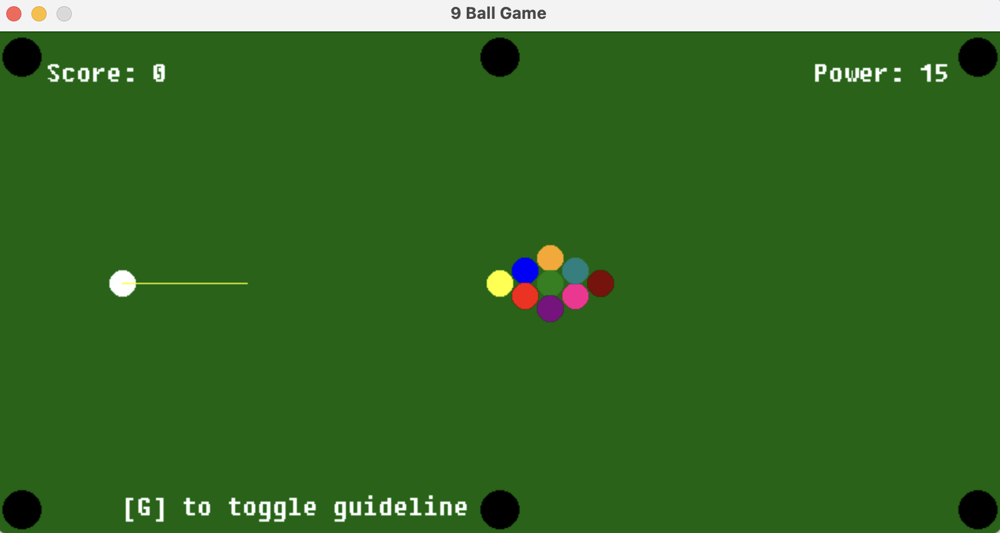
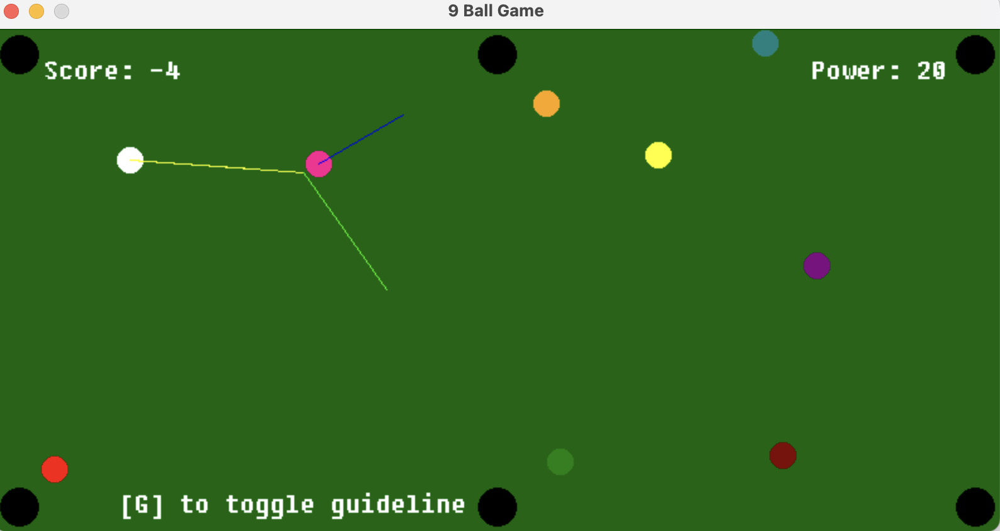

- First real time trying out SDL2.
- Object oriented design of a very basic 9ball game: compile with `make`, or compile and run with `./build.sh`.
- Basically no rules are implemented, the only features are:
    - [x] Screen is the table, 6 pockets around the edges.
    - [x] Nine balls, one cueball. Collision detection across all balls.
    - [x] Cue stick target is visible on the screen to guide the user's aim.
    - [x] Binds: 
        - m1 to shoot ball
        - arrow up to increase power when shooting, arrow down to decrease
        - `G` to show a more advanced cueball trajectory and where it will go on
      impact (along with where any ball it hits will go)
    - [x] Score increments on every ball into pocket, -5 for every scratch
    - [x] Game resets after pocketing all 9 balls. Used std list for constant and common removals from game.

